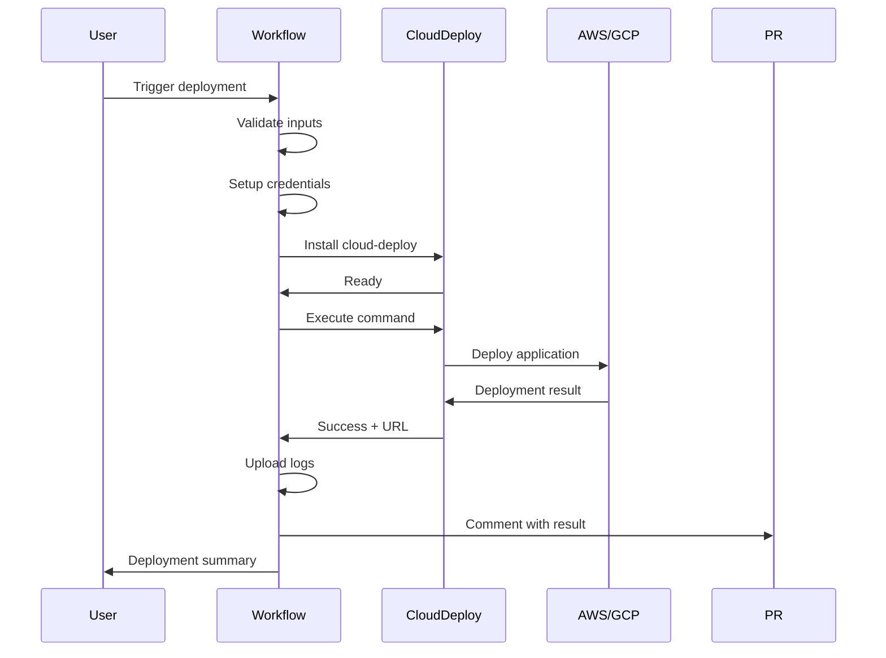
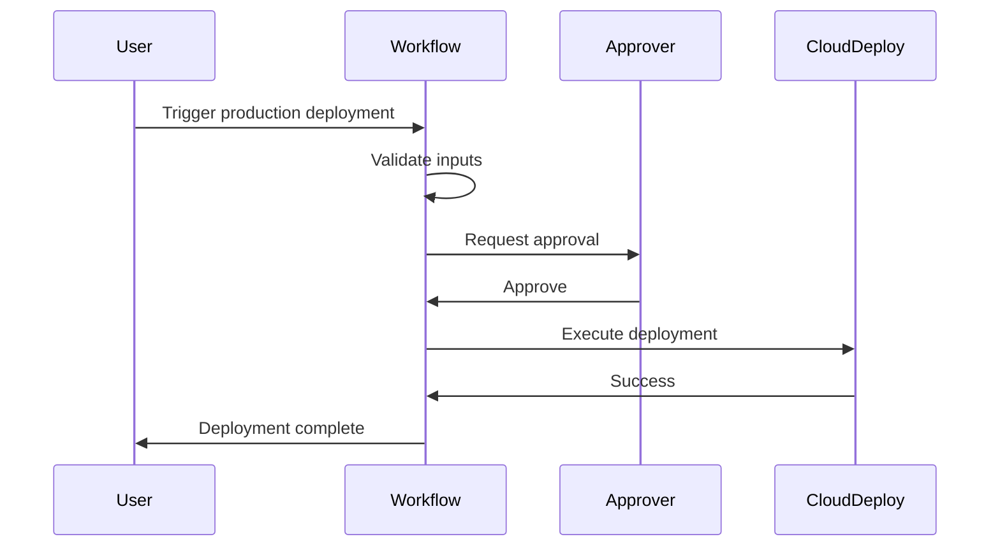

# Deployment Workflows Architecture

This document explains how the cloud-deploy GitHub Actions workflows are structured and how they work together.

## Workflow Architecture

```
┌─────────────────────────────────────────────────────────────────┐
│                     Deployment Triggers                         │
└─────────────────────────────────────────────────────────────────┘
           │                    │                    │
           │                    │                    │
           ▼                    ▼                    ▼
    ┌──────────┐         ┌──────────┐        ┌──────────┐
    │  Manual  │         │ PR Label │        │  Commit  │
    │ Dispatch │         │          │        │  Message │
    └──────────┘         └──────────┘        └──────────┘
           │                    │                    │
           └────────────────────┼────────────────────┘
                                │
                                ▼
                    ┌───────────────────────┐
                    │   deploy.yml          │
                    │  (Reusable Workflow)  │
                    └───────────────────────┘
                                │
                ┌───────────────┼───────────────┐
                │               │               │
                ▼               ▼               ▼
         ┌──────────┐    ┌──────────┐   ┌──────────┐
         │   AWS    │    │   GCP    │   │  Status  │
         │  Deploy  │    │  Deploy  │   │  Check   │
         └──────────┘    └──────────┘   └──────────┘
                │               │               │
                └───────────────┼───────────────┘
                                │
                                ▼
                        ┌───────────────┐
                        │  Deployment   │
                        │    Result     │
                        └───────────────┘
                                │
                ┌───────────────┼───────────────┐
                │               │               │
                ▼               ▼               ▼
         ┌──────────┐    ┌──────────┐   ┌──────────┐
         │ PR       │    │ Logs     │   │  Step    │
         │ Comment  │    │ Artifact │   │ Summary  │
         └──────────┘    └──────────┘   └──────────┘
```

## Workflow Files

### 1. deploy.yml - Core Deployment Workflow

**Type:** Reusable workflow
**Called by:** All other deployment workflows
**Purpose:** Handles actual deployment logic

**Inputs:**
- `provider` - Cloud provider (aws/gcp)
- `environment` - Target environment (staging/production)
- `manifest_path` - Path to manifest file
- `command` - Action to perform (deploy/status/stop/destroy)

**Secrets:**
- AWS credentials
- GCP credentials

**Outputs:**
- `deployment_url` - URL of deployed application
- `deployment_status` - Deployment result

**Key Features:**
- ✅ Validates manifest file exists
- ✅ Configures cloud provider credentials
- ✅ Executes cloud-deploy command
- ✅ Uploads deployment logs
- ✅ Comments on PRs with results
- ✅ Creates deployment summary

### 2. manual-deploy.yml - Manual Deployment Trigger

**Type:** Workflow dispatch
**Trigger:** Manual from GitHub UI
**Purpose:** On-demand deployments with full control

**Flow:**
```
User clicks "Run workflow"
    ↓
Selects parameters:
  - Provider (AWS/GCP)
  - Environment (staging/production)
  - Manifest path
  - Command (deploy/status/stop/destroy)
  - Confirmation (for production/destroy)
    ↓
Validation job checks:
  - Production confirmation
  - Destroy confirmation
    ↓
Calls deploy.yml with parameters
    ↓
Deployment executes
    ↓
Result notification
```

**Safety Features:**
- ✅ Requires typing "CONFIRM" for production
- ✅ Requires typing "CONFIRM" for destroy
- ✅ Validation before execution
- ✅ Environment-based approvals

**Use Cases:**
- Production deployments
- Emergency updates
- Checking deployment status
- Stopping/destroying resources

### 3. label-deploy.yml - PR Label Trigger

**Type:** Pull request event
**Trigger:** Adding labels to PRs
**Purpose:** Automatic deployments for review and testing

**Flow:**
```
Developer adds label to PR
    ↓
Label format: deploy:provider:environment
    ↓
Workflow parses label:
  - deploy:aws:staging → AWS staging
  - deploy:gcp:production → GCP production
    ↓
Validates provider and environment
    ↓
Calls deploy.yml
    ↓
Deployment executes
    ↓
PR comment added with result
    ↓
Label automatically removed
```

**Supported Labels:**
- `deploy:aws:staging`
- `deploy:aws:production`
- `deploy:gcp:staging`
- `deploy:gcp:production`

**Use Cases:**
- Review apps for PRs
- Staging deployments
- QA environment setup
- Feature testing

## Deployment Flow

### Standard Deployment



### With Environment Approval



## Security Model

### Secrets Management

```
Repository Secrets (Settings → Secrets)
    │
    ├── AWS_ACCESS_KEY_ID
    ├── AWS_SECRET_ACCESS_KEY
    │
    ├── GCP_PROJECT_ID
    ├── GCP_CREDENTIALS
    └── GCP_BILLING_ACCOUNT_ID
         │
         ▼
Environment Secrets (Optional - per environment)
    │
    ├── staging/
    │   ├── AWS_ACCESS_KEY_ID (staging credentials)
    │   └── GCP_CREDENTIALS (staging credentials)
    │
    └── production/
        ├── AWS_ACCESS_KEY_ID (production credentials)
        └── GCP_CREDENTIALS (production credentials)
```

### Access Control

**Repository Level:**
- Secrets accessible to workflows
- Protected by repository permissions

**Environment Level (Recommended):**
- Staging: No approvals, anyone can deploy
- Production: Requires approval from designated reviewers
- Secrets scoped per environment

### Permission Model

```
GitHub Repository
    │
    ├── Branch Protection (main)
    │   ├── Require PR reviews
    │   ├── Require status checks
    │   └── Require signatures
    │
    ├── Environments
    │   ├── staging (unrestricted)
    │   └── production
    │       ├── Required reviewers: [SRE team]
    │       ├── Wait timer: 5 minutes
    │       └── Deployment branches: main only
    │
    └── Secrets
        ├── Repository secrets (general access)
        └── Environment secrets (scoped access)
```

## Best Practices

### 1. Separation of Environments

```yaml
# Different manifests for different environments
manifests/
├── staging-aws.yaml       # Small instances, no monitoring
├── staging-gcp.yaml
├── production-aws.yaml    # Larger instances, full monitoring
└── production-gcp.yaml
```

### 2. Approval Workflow

```yaml
# Production deployment with approval
jobs:
  deploy:
    environment:
      name: production        # Requires approval
      url: https://app.com   # Direct link to deployment
```

### 3. Rollback Strategy

```yaml
# Always keep previous deployment manifest
- name: Backup current state
  run: cloud-deploy -command status > pre-deployment.txt

- name: Deploy new version
  run: cloud-deploy -command deploy

- name: Rollback on failure
  if: failure()
  run: cloud-deploy -manifest manifests/previous.yaml -command deploy
```

### 4. Monitoring and Alerts

```yaml
# Add notifications
- name: Notify on success
  if: success()
  uses: slackapi/slack-github-action@v1
  with:
    payload: |
      {
        "text": "✅ Production deployed successfully",
        "url": "${{ needs.deploy.outputs.deployment_url }}"
      }

- name: Alert on failure
  if: failure()
  uses: slackapi/slack-github-action@v1
  with:
    payload: |
      {
        "text": "❌ Production deployment failed",
        "channel": "#alerts"
      }
```

## Common Scenarios

### Scenario 1: Feature Development

```
1. Create feature branch
2. Make changes
3. Create PR
4. Add label: deploy:aws:staging
5. Test deployed PR at staging URL
6. Remove label (auto-removed after deployment)
7. Merge to main
```

### Scenario 2: Production Release

```
1. Merge PR to main
2. Go to Actions → Manual Deployment
3. Select:
   - Provider: gcp
   - Environment: production
   - Confirm: CONFIRM
4. Wait for approval from SRE team
5. Deployment proceeds after approval
6. Verify at production URL
7. Create release tag
```

### Scenario 3: Emergency Hotfix

```
1. Create hotfix branch
2. Make urgent fix
3. Go to Actions → Manual Deployment
4. Select:
   - Provider: aws
   - Environment: production
   - Confirm: CONFIRM
5. Emergency approval granted
6. Deploy immediately
7. Monitor closely
```

### Scenario 4: Scheduled Maintenance

```
1. Schedule downtime
2. Go to Actions → Manual Deployment
3. Select:
   - Command: stop
   - Environment: production
   - Confirm: CONFIRM
4. Resources stopped (not destroyed)
5. Perform maintenance
6. Re-deploy when ready
```

## Troubleshooting

### Workflow Not Triggering

**Problem:** Label added but no deployment

**Debug Steps:**
```bash
# 1. Check workflow is on default branch
git branch --show-current
# Should be 'main' or default branch

# 2. Verify label format
# Correct: deploy:aws:staging
# Wrong: deploy-aws-staging

# 3. Check workflow file syntax
yamllint .github/workflows/label-deploy.yml
```

### Secrets Not Working

**Problem:** Credentials error during deployment

**Debug Steps:**
```bash
# 1. Verify secret names (case-sensitive)
Settings → Secrets and variables → Actions
- Check: AWS_ACCESS_KEY_ID (not aws_access_key_id)

# 2. Check environment scoping
# If using environments, secrets must be in environment, not just repository

# 3. Test secret availability
- name: Test secrets
  run: |
    if [ -z "${{ secrets.AWS_ACCESS_KEY_ID }}" ]; then
      echo "Secret not available"
    fi
```

### Deployment Hanging

**Problem:** Workflow stuck on deployment step

**Common Causes:**
1. Cloud provider API rate limits
2. Invalid credentials
3. Resource quota exceeded
4. Network issues

**Solution:**
```yaml
# Add timeout to deployment step
- name: Deploy
  timeout-minutes: 30  # Fail after 30 minutes
  run: cloud-deploy -command deploy
```

## Next Steps

- Configure [GitHub Environments](https://docs.github.com/en/actions/deployment/targeting-different-environments/using-environments-for-deployment)
- Set up [required reviewers](https://docs.github.com/en/actions/deployment/targeting-different-environments/using-environments-for-deployment#required-reviewers)
- Review [complete examples](../examples/workflows/)
- Read [GitHub Actions guide](GITHUB_ACTIONS.md)
